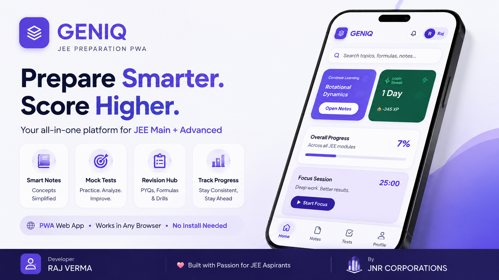

<div align="center">


# 🚀 GenIq-jn

### JEE Main & JEE Advanced — Learning & Practice Platform

**Learn Smart · Understand Deeply · Practice Intelligently · Revise Faster**

<br>


<br><br>



</div>

---

## 📖 Table of Contents

* [🚀 About GenIq-jn](#-about-geniq-jn)
* [🎯 What is GenIq-jn?](#-what-is-geniq-jn)
* [🧠 Learning Philosophy](#-learning-philosophy)
* [📚 Subjects](#-subjects)

  * [⚡ Physics](#-physics)
  * [🧪 Chemistry](#-chemistry)
  * [📐 Mathematics](#-mathematics)
* [🧩 Learning System](#-learning-system)
* [📄 PDF & Handnotes Hub](#-pdf--handnotes-hub)
* [📝 Test System](#-test-system)
* [🎨 UI & Design](#-ui--design)
* [🔎 Search & Navigation](#-search--navigation)
* [📱 Progressive Web App](#-progressive-web-app)
* [📂 Project Structure](#-project-structure)
* [⚙️ Technologies](#️-technologies)
* [🔐 Copyright & License](#-copyright--license)
* [⚠️ Third-Party Materials](#️-third-party-materials)
* [📌 Important Notice](#-important-notice)
* [👨‍💻 Developer](#-developer)
* [🏢 Publisher](#-publisher)
* [🌟 Project Motto](#-project-motto)

---

# 🚀 About GenIq-jn

<div align="center">

> ### **A structured digital learning environment built for serious JEE preparation.**

</div>

**GenIq-jn** is a structured **JEE Main & JEE Advanced learning and practice platform** designed to bring important study resources into one organized ecosystem.

The platform focuses on:

* 📚 Subject-wise learning
* 📖 Chapter-wise notes
* 🧩 Sub-topic organization
* ⚡ High-yield formulas
* 🎯 JEE Main & JEE Advanced concepts
* 📊 Graph-based explanations
* 📝 Practice questions
* 🧠 PYQ-oriented concepts
* 📄 PDF notes and handwritten notes
* 🏆 Advanced-level problem solving
* 🔁 Fast and structured revision

Rather than presenting educational material as a collection of disconnected pages and files, GenIq-jn organizes preparation into a logical learning flow.

> 💡 **The goal is not simply to provide more study material — the goal is to make the right material easier to understand, find, practice, and revise.**

---

# 🎯 What is GenIq-jn?

GenIq-jn is designed around a **structured preparation model**.

Large JEE chapters can often become difficult to navigate because a single chapter may contain dozens of concepts, formulas, examples, questions, and revision points.

GenIq-jn breaks this complexity into smaller connected layers:

```text
                         ┌──────────────┐
                         │   SUBJECT    │
                         └──────┬───────┘
                                │
                                ▼
                         ┌──────────────┐
                         │   CHAPTER    │
                         └──────┬───────┘
                                │
                                ▼
                         ┌──────────────┐
                         │  SUB-TOPIC   │
                         └──────┬───────┘
                                │
                                ▼
                         ┌──────────────┐
                         │   CONCEPT    │
                         └──────┬───────┘
                                │
                                ▼
                         ┌──────────────┐
                         │   FORMULA    │
                         └──────┬───────┘
                                │
                                ▼
                         ┌──────────────┐
                         │    EXAMPLE   │
                         └──────┬───────┘
                                │
                                ▼
                         ┌──────────────┐
                         │ PYQ / PRACTICE│
                         └──────┬───────┘
                                │
                                ▼
                         ┌──────────────┐
                         │   REVISION   │
                         └──────────────┘
```

This structure makes the platform suitable for both **initial learning** and **rapid revision**.

---

# 🧠 Learning Philosophy

GenIq-jn follows the principle:

<div align="center">

### **Concept → Formula → Application → Practice → Revision**

</div>

The platform is designed to emphasize the concepts and problem-solving patterns that matter for competitive examinations.

Instead of overwhelming the learner with disconnected information, the system attempts to create a path from **understanding to application**.

### 🔥 The GenIq-jn Learning Cycle

```text
        ┌───────────────┐
        │   UNDERSTAND  │
        └───────┬───────┘
                │
                ▼
        ┌───────────────┐
        │    FORMULA    │
        └───────┬───────┘
                │
                ▼
        ┌───────────────┐
        │   EXAMPLE     │
        └───────┬───────┘
                │
                ▼
        ┌───────────────┐
        │   PRACTICE    │
        └───────┬───────┘
                │
                ▼
        ┌───────────────┐
        │     TEST      │
        └───────┬───────┘
                │
                ▼
        ┌───────────────┐
        │   ANALYSE     │
        └───────┬───────┘
                │
                ▼
        ┌───────────────┐
        │    REVISE     │
        └───────┬───────┘
                │
                └──────────────► 🔁
```

> 💡 **Revision is not treated as an afterthought. It is part of the learning architecture itself.**

---

# 📚 Subjects

GenIq-jn is centered around the three major JEE subjects:

| Subject            | Focus                                                                |
| ------------------ | -------------------------------------------------------------------- |
| ⚡ **Physics**      | Concepts, visual understanding, formulas, graphs and problem solving |
| 🧪 **Chemistry**   | Physical, Organic and Inorganic Chemistry                            |
| 📐 **Mathematics** | Algebra, Calculus, Coordinate Geometry and other JEE-relevant areas  |

---

# ⚡ Physics

The Physics section is organized around important JEE concepts and problem-solving areas.

### 📌 Major Areas

| Area                    | Included Topics                                                   |
| ----------------------- | ----------------------------------------------------------------- |
| 🚀 Mechanics            | Kinematics, Motion in 1D & 2D, Relative Motion, Projectile Motion |
| ⚙️ Dynamics             | Laws of Motion, Friction, Circular Motion                         |
| 🔋 Energy               | Work, Energy & Power                                              |
| 🔄 Rotational Systems   | Centre of Mass, Rotational Motion                                 |
| 🌍 Gravitation          | Gravitation and related applications                              |
| 🌡️ Thermal Physics     | Properties of Matter, Thermodynamics                              |
| 🌊 Oscillations & Waves | SHM, Waves                                                        |
| ⚡ Electricity           | Electrostatics, Current Electricity                               |
| 🧲 Magnetism            | Magnetism, EMI & AC                                               |
| 🔭 Optics               | Optics and visual concepts                                        |
| ⚛️ Modern Physics       | Modern Physics                                                    |

### Physics Topic Map

```text
Physics
│
├── Mechanics
│   ├── Kinematics
│   ├── Motion in 1D
│   ├── Motion in 2D
│   ├── Relative Motion
│   ├── Projectile Motion
│   ├── Laws of Motion
│   ├── Work, Energy & Power
│   ├── Circular Motion
│   ├── Centre of Mass
│   └── Rotational Motion
│
├── Gravitation
│
├── Properties of Matter
│
├── Thermodynamics
│
├── SHM
│
├── Waves
│
├── Electrostatics
│
├── Current Electricity
│
├── Magnetism
│
├── EMI & AC
│
├── Optics
│
└── Modern Physics
```

---

# 🧪 Chemistry

Chemistry is divided into three major sections:

```text
                     CHEMISTRY
                         │
          ┌──────────────┼──────────────┐
          │              │              │
          ▼              ▼              ▼
     PHYSICAL         ORGANIC       INORGANIC
     CHEMISTRY        CHEMISTRY      CHEMISTRY
```

### 🔬 Physical Chemistry

Focused on numerical understanding, equations, concepts, and applications.

### 🧬 Organic Chemistry

Organized around reactions, mechanisms, concepts, and important problem-solving patterns.

### 🧱 Inorganic Chemistry

Organized around periodic trends, concepts, reactions, properties, and important factual relationships.

> 💡 Chemistry resources are designed to remain **chapter-wise and sub-topic-wise**, allowing targeted revision instead of searching through unrelated material.

---

# 📐 Mathematics

The Mathematics section covers major JEE-relevant areas including:

| Domain                    | Topics                                                    |
| ------------------------- | --------------------------------------------------------- |
| 🔢 Algebra                | Algebraic concepts and problem solving                    |
| 📍 Coordinate Geometry    | Coordinate-based geometric problems                       |
| ∫ Calculus                | Limits, differentiation, integration and related concepts |
| 🧭 Vectors                | Vector-based mathematics                                  |
| 📐 3D Geometry            | Three-dimensional geometry                                |
| 📊 Trigonometry           | Identities, equations and applications                    |
| 🎲 Probability            | Probability-based problem solving                         |
| 📈 Statistics             | Statistical concepts                                      |
| 🧠 Mathematical Reasoning | Logical and mathematical reasoning                        |
| 📚 Other Topics           | Additional JEE-relevant concepts                          |

---

# 🧩 Learning System

The core GenIq-jn architecture follows:

```text
┌────────────────────┐
│      SUBJECT       │
└─────────┬──────────┘
          │
          ▼
┌────────────────────┐
│      CHAPTER       │
└─────────┬──────────┘
          │
          ▼
┌────────────────────┐
│     SUB-TOPIC      │
└─────────┬──────────┘
          │
          ▼
┌────────────────────┐
│      CONCEPT       │
└─────────┬──────────┘
          │
          ▼
┌────────────────────┐
│      FORMULA       │
└─────────┬──────────┘
          │
          ▼
┌────────────────────┐
│      EXAMPLE       │
└─────────┬──────────┘
          │
          ▼
┌────────────────────┐
│   PYQ / PRACTICE   │
└─────────┬──────────┘
          │
          ▼
┌────────────────────┐
│      REVISION      │
└────────────────────┘
```

### Why this structure?

Because a student rarely needs only one thing.

A concept often requires:

**Explanation → Formula → Example → Practice → Revision**

GenIq-jn attempts to keep these elements connected.

---

# 📄 PDF & Handnotes Hub

GenIq-jn includes a dedicated resource ecosystem for educational PDFs and study material.

### 📚 Resource Categories

| Resource               | Purpose                                |
| ---------------------- | -------------------------------------- |
| 🧮 Formula Sheets      | Rapid formula revision                 |
| ⚡ High-Yield Notes     | Important concepts and revision points |
| ✍️ Handwritten Notes   | Detailed handwritten study material    |
| 📖 Topic-wise PDFs     | Focused topic preparation              |
| 🔁 Revision Material   | Quick pre-test / pre-exam revision     |
| 🧠 Problem Collections | Targeted problem-solving practice      |

### Resource Organization

```text
PDF / NOTES HUB
│
├── Physics
│   ├── Chapter
│   │   ├── Sub-topic
│   │   │   └── PDF / Notes
│
├── Chemistry
│   ├── Physical
│   ├── Organic
│   └── Inorganic
│
└── Mathematics
    ├── Chapter
    ├── Sub-topic
    └── PDF / Notes
```

This organization makes it easier to locate a specific resource without navigating through an unstructured collection of files.

---

# 📝 Test System

GenIq-jn includes a dedicated test and practice structure.

The test system is designed to support different levels of preparation:

```text
                         📝 TEST SYSTEM
                              │
              ┌───────────────┼───────────────┐
              │               │               │
              ▼               ▼               ▼
          PHYSICS         CHEMISTRY       MATHEMATICS
              │               │               │
              └───────────────┼───────────────┘
                              │
                              ▼
                     ┌────────────────┐
                     │  TOPIC TESTS   │
                     └───────┬────────┘
                             ▼
                     ┌────────────────┐
                     │ CHAPTER TESTS  │
                     └───────┬────────┘
                             ▼
                     ┌────────────────┐
                     │   MIXED TESTS  │
                     └───────┬────────┘
                             ▼
                     ┌────────────────┐
                     │  JEE MAIN      │
                     └───────┬────────┘
                             ▼
                     ┌────────────────┐
                     │ JEE ADVANCED   │
                     └────────────────┘
```

### Supported Test Categories

* 🎯 Chapter Tests
* 🧩 Topic Tests
* 🔀 Mixed Tests
* 🟢 JEE Main Level Questions
* 🔴 JEE Advanced Level Questions
* 🔁 Revision Tests

---

# 🎨 UI & Design

GenIq-jn follows a modern, learning-focused visual language.

### ✨ Interface Characteristics

* 🪟 Glassmorphic cards
* 📱 Responsive layouts
* 🧭 Subject-based navigation
* 🧩 Topic cards
* ⚡ Formula boxes
* 💡 High-yield callouts
* 📊 Visual graphs
* 📄 PDF resource cards
* 🔎 Search functionality
* 📱 Mobile-friendly design

### Visual Design Philosophy

The interface should help students **scan information quickly**.

Important formulas, concepts, resources, and navigation elements should be visually distinguishable without making the interface unnecessarily complicated.

> 💡 **Beautiful UI is useful only when it improves the learning experience.**

GenIq-jn therefore aims for a balance between:

**Aesthetic Design + Academic Clarity + Fast Navigation**

---

# 🔎 Search & Navigation

The platform can organize searchable resources using multiple levels:

```text
Search
  │
  ├── Subject
  │
  ├── Chapter
  │
  ├── Topic
  │
  ├── Sub-topic
  │
  └── PDF Material
```

This enables targeted navigation when a student needs to quickly locate a particular concept or revision resource.

### Example

```text
Search: "Projectile Motion"

        ↓

Physics

        ↓

Kinematics

        ↓

Projectile Motion

        ↓

Concepts

        ↓

Formula

        ↓

Practice / PYQ

        ↓

Revision
```

---

# 📱 Progressive Web App

GenIq-jn includes PWA-related components:

```text
manifest.json
      │
      ▼
 Progressive Web App
      │
      ▼
     sw.js
      │
      ├── Service Worker
      ├── Caching
      └── Modern Web-App Capabilities
```

### PWA Components

| File            | Role                         |
| --------------- | ---------------------------- |
| `manifest.json` | PWA application metadata     |
| `sw.js`         | Service-worker functionality |
| `index.html`    | Main application entry       |
| `style.css`     | Interface styling            |
| `script.js`     | Application logic            |

The platform is designed to remain lightweight and accessible through modern web browsers.

---

# 📂 Project Structure

The repository is organized into application pages, scripts, styling, data, educational resources, and tests.

```text
GenIq-jn/
│
├── 📄 index.html
├── 📄 ji.html
├── 📄 physics_test.html
├── 📄 file-2.html
│
├── ⚙️ script.js
├── 🎨 style.css
│
├── 📱 manifest.json
├── 🔄 sw.js
│
├── 🔐 LICENSE
├── 📖 README.md
│
├── 📁 assets/
│   ├── 🖼️ images/
│   └── 🎨 icons/
│
├── 📁 pdfs/
│   ├── ⚡ physics/
│   ├── 🧪 chemistry/
│   └── 📐 mathematics/
│
├── 📁 data/
│   ├── physics.js
│   ├── chemistry.js
│   ├── mathematics.js
│   ├── pdf-data.js
│   ├── topics.js
│   └── tests.js
│
└── 📁 tests/
    ├── ⚡ physics/
    ├── 🧪 chemistry/
    └── 📐 mathematics/
```

### 🧱 Architecture at a Glance

```text
                     GenIq-jn/
                         │
       ┌─────────────────┼─────────────────┐
       │                 │                 │
       ▼                 ▼                 ▼
   FRONTEND            DATA             RESOURCES
       │                 │                 │
       │                 │                 ├── PDFs
       │                 │                 ├── Notes
       │                 │                 └── Handnotes
       │                 │
       │                 ├── Physics
       │                 ├── Chemistry
       │                 ├── Mathematics
       │                 ├── Topics
       │                 └── Tests
       │
       ├── HTML
       ├── CSS
       ├── JavaScript
       └── PWA
```

---

# ⚙️ Technologies

GenIq-jn is built using lightweight web technologies.

<div align="center">


</div>

### Technology Breakdown

| Technology                | Purpose                                      |
| ------------------------- | -------------------------------------------- |
| **HTML5**                 | Page structure and content                   |
| **CSS3**                  | Visual design, responsive layouts and UI     |
| **JavaScript**            | Dynamic functionality and application logic  |
| **SVG**                   | Scalable visual elements                     |
| **PWA Technologies**      | Modern web-app capabilities                  |
| **JavaScript Data Files** | Structured subject, topic, PDF and test data |

---

# 🔐 Copyright & License

<div align="center">

## 🔒 PROPRIETARY SOFTWARE

### © 2026 JNR Corporations / Yogendra (Raj) Verma

**All Rights Reserved.**

</div>

GenIq-jn is **proprietary software**.

The following materials are protected under the project's proprietary terms:

* Source code
* Original UI implementation
* Architecture
* Original designs
* Scripts
* Components
* Structured datasets
* Educational organization
* Original project materials

Without prior written permission, these materials may not be:

* ❌ Copied
* ❌ Reused
* ❌ Modified
* ❌ Redistributed
* ❌ Republished
* ❌ Cloned
* ❌ Sold
* ❌ Incorporated into another project

> ⚠️ **GenIq-jn is NOT an open-source project.**

---

## 🤖 AI / Scraping Restriction

Without prior written authorization, systematic use of GenIq-jn's proprietary materials for:

* AI model training
* AI fine-tuning
* Dataset creation
* Automated content extraction
* Systematic scraping
* Large-scale reproduction
* Automated mirroring

is not permitted.

This restriction applies to substantial portions of the project's original source code, proprietary educational material, structured datasets, and other protected original content.

For complete legal terms, refer to:

```text
LICENSE
```

---

# ⚠️ Third-Party Materials

GenIq-jn may reference or contain third-party materials, including:

* Libraries
* Frameworks
* Fonts
* Icons
* Educational resources
* PDFs
* Images
* APIs

Third-party materials remain subject to the licenses and copyrights of their respective owners.

> 💡 **The GenIq-jn proprietary license does not override any applicable third-party license.**

---

# 📌 Important Notice

Access to or viewing of the GenIq-jn website does **not** grant permission to:

* Copy proprietary source code
* Reproduce original materials
* Modify protected content
* Redistribute project resources
* Clone the platform
* Commercially exploit proprietary materials

### Public ≠ Open Source

```text
┌─────────────────────────────────────┐
│         PUBLICLY ACCESSIBLE         │
└──────────────────┬──────────────────┘
                   │
                   │  ≠
                   ▼
┌─────────────────────────────────────┐
│             OPEN SOURCE             │
└─────────────────────────────────────┘
```

> 🔐 **Public availability does not mean open-source availability.**

---

# 👨‍💻 Developer

<div align="center">

## Yogendra (Raj) Verma

### Creator & Developer of GenIq-jn

</div>

GenIq-jn is developed by **Yogendra (Raj) Verma**, with the objective of creating a structured digital preparation environment for JEE Main and JEE Advanced aspirants.

---

# 🏢 Published Under

<div align="center">

## JNR Corporations

**Publisher & Distribution Entity**

</div>

GenIq-jn is published and distributed under **JNR Corporations**.

---

# 📊 Project Identity

| Property             | Details                                             |
| -------------------- | --------------------------------------------------- |
| 🚀 Project           | **GenIq-jn**                                        |
| 🎯 Target            | **JEE Main & JEE Advanced**                         |
| 📚 Domain            | **Education / Competitive Examination Preparation** |
| ⚡ Subjects           | **Physics, Chemistry, Mathematics**                 |
| 📱 Platform          | **Progressive Web App**                             |
| 💻 Core Technologies | **HTML5, CSS3, JavaScript, SVG**                    |
| 📄 Resources         | **PDFs, Notes, Handnotes, Formula Sheets**          |
| 📝 Assessment        | **Topic, Chapter, Mixed & JEE-level Tests**         |
| 👨‍💻 Developer      | **Yogendra (Raj) Verma**                            |
| 🏢 Publisher         | **JNR Corporations**                                |
| 🔐 License           | **Proprietary**                                     |
| 📅 Copyright         | **© 2026**                                          |

---

# 🏆 What Makes GenIq-jn Different?

GenIq-jn is designed around **organization**.

Instead of thinking:

```text
"Where is the PDF?"
```

the platform encourages:

```text
"What am I studying?"
        ↓
"Which chapter?"
        ↓
"Which sub-topic?"
        ↓
"Which concept?"
        ↓
"Which formula?"
        ↓
"How do I apply it?"
        ↓
"Can I solve the problem?"
        ↓
"What do I need to revise?"
```

That is the central idea behind the project.

---

# 🌟 Project Motto

<div align="center">

# **Learn Smart. Practice Hard. Revise Fast.**

### JEE Main • JEE Advanced • Physics • Chemistry • Mathematics

<br>

**GenIq-jn**

**A structured approach to competitive examination preparation.**

<br>

---

### 👨‍💻 Developed by

# **Yogendra (Raj) Verma**

### 🏢 Published under

# **JNR Corporations**

<br>

**© 2026 JNR Corporations / Yogendra (Raj) Verma**

### 🔒 All Rights Reserved.

</div>

---

<div align="center">

### 🚀 GenIq-jn

**Concept → Formula → Application → Practice → Revision**

<br>


<br><br>

<sub>Built for structured JEE preparation.</sub>

</div>
